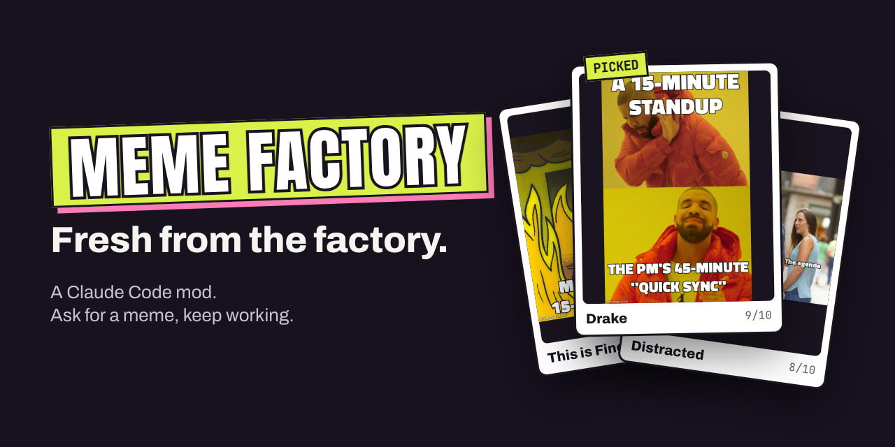
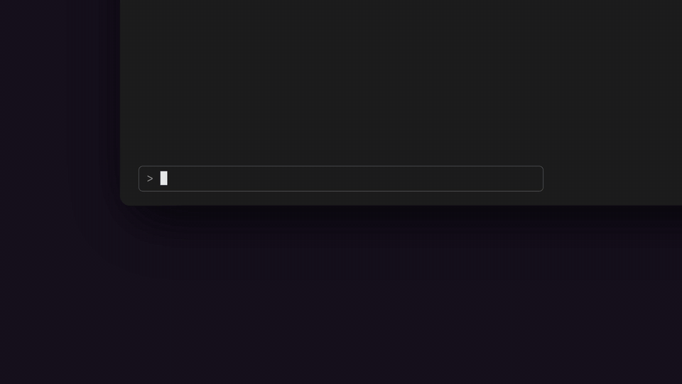
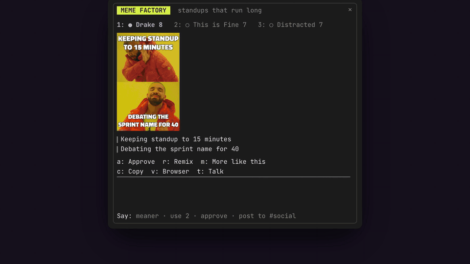
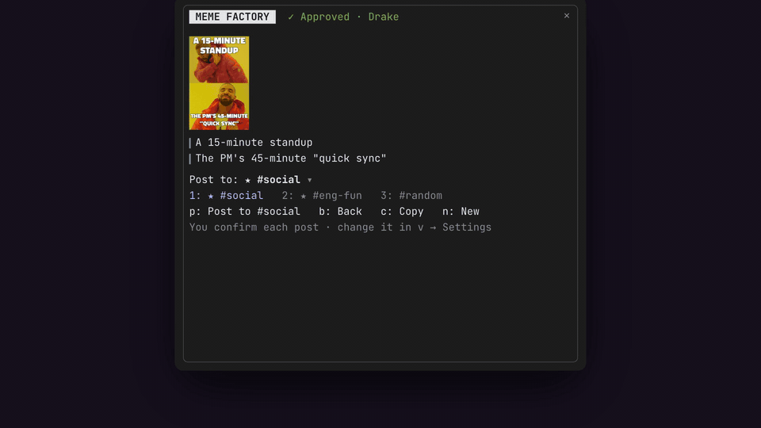
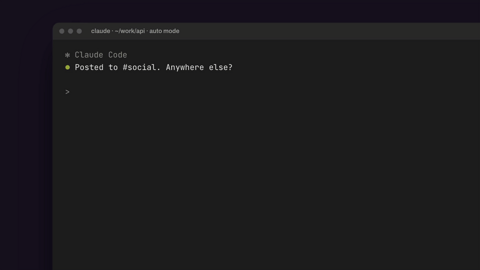

<p align="center">
  
</p>

<p align="center">
  <a href="LICENSE"></a>
  <a href="https://code.claude.com/docs/en/plugins/mods/create"></a>
  <a href="https://github.com/CodyAMaughan/meme-factory/actions/workflows/ci.yml"></a>
</p>

**Fresh from the factory.** Meme Factory is a [Claude Code mod](https://code.claude.com/docs/en/plugins/mods/create). Ask Claude for a meme and three drafts cook in a side panel while you keep working. Pick one, remix it in plain words, approve it, and post it to Slack, signed *Fresh from the [Meme Factory](https://github.com/CodyAMaughan/meme-factory)*.

<p align="center">
  <a href="docs/media/hero.mp4"></a>
</p>

## Install

**Paste this into Claude Code** and it sets everything up:

```text
Install the Meme Factory mod for me. Run `claude plugin marketplace add CodyAMaughan/meme-factory`
and then `claude plugin install meme-factory@meme-factory`. Check that `claude --version` is 2.1.287
or later and that `python3` is available, and tell me if either isn't. Then tell me to run
/reload-plugins (or restart Claude Code) and try `/meme standups that run long`. If I don't have
the Slack connector, point me to https://claude.ai/directory to add it.
```

Or run the commands yourself:

```bash
claude plugin marketplace add CodyAMaughan/meme-factory
claude plugin install meme-factory@meme-factory
```

Inside a session, `/plugin install meme-factory --marketplace CodyAMaughan/meme-factory` does the same.

**Requirements:** Claude Code **v2.1.287 or later** (mods), in the terminal or the Desktop app. `python3` for the browser gallery. To post, the [Slack connector](https://claude.ai/directory); other connectors work through Claude.

## How it works

1. **Ask.** Tell Claude "make a meme about this flaky test", or type `/meme standups that run long`. The tool returns right away, so nothing waits on the meme.
2. **Pick.** Three drafts land in the panel, each with a judge's score. Switch with `1` `2` `3`.
3. **Remix in plain words.** Type in the chat box (`t` jumps to it): "meaner", "make it about the PM", "use 2", "different format", "approve it and post it to #social".
4. **Approve and post.** `a` approves. Pick a channel (favorites first), press `p`, confirm, and the mod uploads the image to Slack. You get the message link.

<table>
  <tr>
    <td width="50%"><a href="docs/media/remix.mp4"></a><br><b>Remix in plain words.</b> A small model turns what you type into actions.</td>
    <td width="50%"><a href="docs/media/post.mp4"></a><br><b>Post to real channels.</b> Your Slack channels, your favorites, and a confirm step.</td>
  </tr>
  <tr>
    <td width="50%"><a href="docs/media/gallery.mp4"></a><br><b>The browser gallery.</b> Press <code>v</code> for the same flow with bigger pictures.</td>
    <td width="50%"><a href="docs/media/anywhere.mp4"></a><br><b>Fits wherever you work.</b> Pictures where the terminal can draw them, a compact strip in narrow windows.</td>
  </tr>
  <tr>
    <td colspan="2"><a href="docs/media/safety.mp4"></a><br><b>Nothing posts without you.</b> Ask-before-posting holds any post until you say so, even in auto mode.</td>
  </tr>
</table>

## Posting

After you approve, the **Post to** list shows where it can go:

| Destination | What happens |
|---|---|
| **Your Slack channels** | The mod uploads the image itself, so Slack shows the picture, signed *Fresh from the Meme Factory 🏭* with a link back here. You get the message link. |
| **Favorites** ★ | Channels or places you saved (★ Save after a post, or Settings). The first three are keys `1` `2` `3`. |
| **Through Claude** | Other connectors that can post (Gmail, for example), or anything you type ("my LinkedIn"). The mod hands those to Claude, which picks the connector and channel. |
| **+ Add a connector** | Asks Claude to find one in the [connector directory](https://claude.ai/directory) and show you its Connect card. |

**Ask before posting** is on by default. Slack posts wait for your **Post it** in the panel or the gallery. Posts Claude makes for you are held when Claude calls the connector, with a **Post it / Don't post** question, in every permission mode.

The mod includes no posting integrations of its own: it uses the connectors you've added to Claude.

## Pictures

| Where | What you see |
|---|---|
| **Ghostty**, **kitty** 0.28+, cmux | The real meme, in the panel (kitty graphics protocol). |
| **iTerm2** 3.7.3+ | The real meme if you start Claude with `CLAUDE_CODE_FORCE_TERMINAL_IMAGES=1 claude` ([why](https://github.com/anthropics/claude-code/issues/95448)). Export it in your shell; `settings.json` doesn't work. |
| **Terminal.app**, **VS Code**, **Cursor**, tmux | A one-line note. Press `v` for the browser gallery. |
| **Desktop app** | The meme, as an image. |

In a wide window (about 144+ columns) the panel docks beside the transcript. In a narrower one it's a strip of up to six rows above the prompt.

## The browser gallery

Press `v` in the panel, or run `/meme gallery`. Everything there goes straight back to your session:

- **Drafts:** pick with a click or `1` `2` `3`, **Approve** with `a`, **Remix all** with `r`, and `/` for the chat box.
- **Post it:** favorites, a searchable list of your Slack channels, then **Post to #channel** (`p`), confirm (`y` / `n`), and the message link.
- **Settings** (`/meme settings`), saved as you change them: ask before posting, signing posts, favorites (in order, reorderable), and which connectors this session can post through.

It's a small local server (`gallery/server.py`, standard library only) on `127.0.0.1`. It answers only requests that carry the session's random token, refuses other origins and hosts, and stops when the session ends.

## Configuration

| Environment variable | Effect |
|---|---|
| `MEME_FACTORY_MODEL` | Model for writing and judging: an alias like `haiku` or `sonnet`, or a full model id. Default `haiku`. |
| `TYPESAFE_API_KEY` | Uses [Jev](https://typesafe.ai) to pick templates and judge drafts, at about $0.0003 per meme. |

Posting settings and favorites live in the gallery's **Settings** tab.

## Privacy

- **Model calls** go through your Claude Code session's own credentials. There's no API key to set, and they count toward your plan like any other request.
- **Pictures** are rendered by [memegen.link](https://memegen.link) from the template and the caption text, and cached in `~/.cache/meme-factory/`.
- **Posts** go only where you send them, through your connectors.
- **Jev**, if you set `TYPESAFE_API_KEY`, receives the meme request and the draft captions.
- The mod keeps your settings and your last 50 approved memes in its local store.

## Troubleshooting

- **The panel didn't open.** A panel the mod opens by itself waits for a window at least 144 columns wide. Run `/meme` to open it at any width.
- **No picture in the terminal.** See [Pictures](#pictures). Press `v` to see it in the browser.
- **"The gallery needs python3".** Install Python 3, or use the panel.
- **No Slack channels listed.** Add the Slack connector at [claude.ai/directory](https://claude.ai/directory), then **Check again** in Settings.

## Develop

```bash
git clone https://github.com/CodyAMaughan/meme-factory
cd meme-factory
claude plugin validate --strict .
claude plugin test .
claude --plugin-dir .          # hot-reloads hooks/ on save
```

In the Desktop app, set `CLAUDE_CODE_PLUGIN_DIRS` to the absolute path of your checkout (in your environment, or under `env` in `~/.claude/settings.json`), then start a new session.

| Path | Contents |
|---|---|
| `hooks/register.js` | Every mods API call: the `make_meme` tool, `/meme`, the drafting pipeline, chat, Slack posting, the panel, the gallery bridge, and the ask-before-posting gate |
| `hooks/lib.js` | Pure helpers: prompts, parsing, memegen URLs, Jev requests, PNG sizing, connector detection, destinations |
| `hooks/templates.js` | The memegen.link template catalog |
| `gallery/` | The browser gallery: `server.py` and `index.html` |
| `tests/` | `claude plugin test` suites, with the model, shell and store stubbed |
| `demo/` | The videos above, built with [HyperFrames](https://github.com/heygen-com/hyperframes). See [demo/README.md](demo/README.md) to re-render. |

## Contributing

Issues and pull requests are welcome. See [CONTRIBUTING.md](CONTRIBUTING.md). Every change is reviewed by the maintainer before it merges.

## License

[MIT](LICENSE). Meme templates are rendered by [memegen.link](https://memegen.link). Demo fonts are under the SIL Open Font License.
